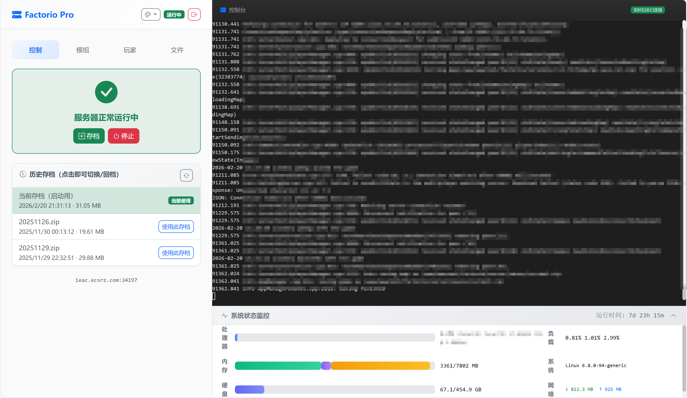

# FactorioWeb

FactorioWeb 是一个功能强大的 Factorio 游戏服务器 Web 管理面板，提供了直观、便捷的服务器管理工具，支持实时监控、Mod 管理、玩家管理等多种功能。

## 项目功能

### 🎮 服务器控制
- **启动/停止服务器**：通过 Web 界面一键启动或停止 Factorio 服务器
- **版本管理**：支持选择不同的 Factorio 服务端版本，自动检查更新
- **地图管理**：切换地图存档，查看和管理历史存档，支持回档操作
- **游戏保存**：一键保存游戏进度

### 📦 Mod 管理
- **Mod 门户**：直接从 Factorio Mod 门户下载和安装 Mod
- **本地上传**：支持从本地上传 Mod 文件（.zip 格式）
- **已安装列表**：查看和管理已安装的 Mod

### 👥 玩家管理
- **玩家操作**：踢出 (Kick)、封禁 (Ban)、解封 (Unban) 玩家
- **权限管理**：设置管理员，添加/移除白名单
- **物品投放**：给指定玩家投放物品，支持从物品库中选择物品

### 📄 配置管理
- **配置编辑器**：详细的服务器配置编辑界面，支持设置服务器名称、描述、最大玩家数等
- **配置文件管理**：上传、管理配置文件
- **自动前缀**：自动为服务器名称和描述添加前缀

### 📊 系统监控
- **实时监控**：监控服务器 CPU、内存、硬盘、网络使用情况
- **系统信息**：查看系统运行时间、负载等信息
- **实时日志**：通过 WebSocket 实时查看服务器日志

### 🎨 界面功能
- **多皮肤支持**：默认风格、现代风格、Factorio 风格
- **响应式设计**：适配不同屏幕尺寸
- **实时通知**：操作结果实时通知

### 🔧 技术特性
- **WebSocket 支持**：通过 WebSocket 实现实时通信
- **安全认证**：登录系统，保护管理面板安全
- **命令执行**：支持执行 Factorio 服务器命令
- **物品库**：内置 Factorio 2.0 + Space Age 物品库，支持中文/英文搜索

## 技术栈

- **后端**：PHP + Workerman (WebSocket 服务器)
- **前端**：HTML + JavaScript + Bootstrap 5 + Axios + XTerm.js
- **配置文件**：JSON 格式

## 目录结构

```
FactorioWeb/
├── data/                  # 配置文件示例目录
│   ├── map-gen-settings.example.json
│   ├── map-settings.example.json
│   ├── server-settings.example.json
│   └── server-whitelist.example.json
├── server/                # 服务器配置目录
│   ├── configs/           # 服务器配置文件
│   ├── server-adminlist.json
│   └── server-banlist.json
├── setting/               # 实际使用的配置文件目录
│   ├── map-gen-settings.example.json
│   ├── map-settings.example.json
│   ├── server-settings.example.json
│   ├── server-settings.json
│   └── server-whitelist.example.json
├── web/                   # Web 界面目录
│   ├── Workerman/         # Workerman WebSocket 库
│   ├── static/            # 静态资源
│   │   ├── js/            # JavaScript 文件
│   │   ├── lib/           # 第三方库
│   │   ├── skins/         # 界面皮肤
│   │   └── items.json     # 物品库数据
│   ├── api.php            # API 接口
│   ├── auth.php           # 认证系统
│   ├── config-editor.php  # 配置编辑器
│   ├── index.html         # 主页
│   ├── log_ws.php         # WebSocket 日志服务
│   └── ...                # 其他 Web 界面文件
├── README.md              # 项目说明
└── image.png              # 项目图片
```

## 安装方法

### 1. 克隆仓库

```bash
git clone https://github.com/airxw/FactorioWeb.git
cd FactorioWeb
```

### 2. 安装依赖

项目使用 PHP 和 Workerman，需要确保服务器上安装了 PHP 7.4 或更高版本。

```bash
# 安装 Workerman 依赖
cd web/Workerman
composer install
```

### 3. 配置服务器

1. **复制配置文件示例**：

```bash
# 复制服务器设置文件
cp setting/server-settings.example.json setting/server-settings.json

# 复制地图生成设置文件
cp setting/map-gen-settings.example.json setting/map-gen-settings.json

# 复制地图设置文件
cp setting/map-settings.example.json setting/map-settings.json
```

2. **编辑配置文件**：根据你的服务器环境进行调整。

### 4. 配置 Web 服务器

#### 使用宝塔面板（推荐）

<<<<<<< HEAD
1. 在宝塔面板中创建一个网站
2. 网站根目录设置为 `FactorioWeb/web`
3. 配置 PHP 版本为 7.4 或更高
4. 启动网站
=======
### 5. 配置 Web 服务器
建议新手使用宝塔直接梭哈，配置好后直接在宝塔中启动项目即可。如果使用宝塔梭哈，请不用看以下内容。
>>>>>>> 4709173d3d928a8055b6114a2efbd6f92f40bc22

#### 手动配置 Nginx

```nginx
server {
    listen 80;
    server_name factorio-web.example.com;
    root /path/to/FactorioWeb/web;
    index index.html index.php;

    location / {
        try_files $uri $uri/ /index.html;
    }

    location ~ \.php$ {
        fastcgi_pass unix:/run/php/php7.4-fpm.sock;
        fastcgi_index index.php;
        fastcgi_param SCRIPT_FILENAME $document_root$fastcgi_script_name;
        include fastcgi_params;
    }
}
```

### 5. 启动 WebSocket 服务器

```bash
# 启动 WebSocket 服务器
cd web
php log_ws.php start
```

## 使用说明

### 1. 访问 Web 界面

在浏览器中访问你的服务器地址，例如 `http://factorio-web.example.com`。

### 2. 登录系统

首次访问时，你需要登录系统。默认登录凭据可能需要在 `auth.php` 文件中配置。

### 3. 服务器控制（控制标签页）

#### 启动服务器
1. 在「控制」标签页中，选择要使用的服务端版本
2. 选择要加载的地图存档
3. 点击「启动服务器」按钮

#### 停止服务器
1. 当服务器运行时，点击「停止」按钮

#### 保存游戏
1. 当服务器运行时，点击「存档」按钮

#### 切换地图
1. 在「历史存档」列表中，点击要使用的存档
2. 确认切换操作

### 4. Mod 管理（模组标签页）

#### 从 Mod 门户安装
1. 点击「打开 Mod 门户」按钮
2. 输入 Factorio.com 的用户名和 Token
3. 搜索要安装的 Mod
4. 点击 Mod 旁边的安装按钮

#### 本地上传 Mod
1. 点击「本地上传」按钮
2. 选择要上传的 Mod 文件（.zip 格式）
3. 点击「上传」按钮

### 5. 玩家管理（玩家标签页）

#### 玩家操作
1. 在「目标玩家」输入框中输入玩家名称
2. 点击对应的操作按钮：
   - 🔴 封禁 (Ban)
   - 🟠 踢出 (Kick)
   - 🟢 设为管理
   - 🔵 解封
   - 🟣 + 加白名单
   - ⚫ - 移出白名单

#### 给玩家发送物品
1. 在「目标玩家」输入框中输入玩家名称
2. 点击「打开物品库」按钮
3. 在物品库中选择要发送的物品
4. 输入要发送的数量
5. 点击「发送」按钮

### 6. 文件管理（文件标签页）

#### 上传文件
1. 在「快速上传」区域，选择要上传的文件（支持 .zip 和 .json 格式）
2. 点击上传按钮

#### 管理文件
- **地图存档**：查看和管理服务器的地图存档
- **配置文件**：查看和管理服务器的配置文件

### 7. 配置编辑器

1. 在浏览器中访问 `http://factorio-web.example.com/config-editor.php`
2. 填写配置文件名
3. 配置服务器基本信息、玩家设置、可见性设置、认证信息、网络设置等
4. 点击「保存为新配置副本」按钮

### 8. 系统监控

在主界面下方的「系统状态监控」区域，可以查看服务器的实时状态：
- CPU 使用情况
- 内存使用情况
- 硬盘使用情况
- 网络流量
- 系统运行时间和负载

### 9. 皮肤切换

点击顶部的皮肤切换按钮，可以选择不同的界面风格：
- 默认风格
- 现代风格
- Factorio 风格

## 安全注意事项

1. **修改默认登录凭据**：确保修改默认的登录凭据，使用强密码
2. **限制访问**：考虑使用防火墙或 IP 白名单限制对 Web 界面的访问
3. **定期更新**：定期更新项目代码和依赖，以修复安全漏洞
4. **使用 HTTPS**：在生产环境中使用 HTTPS 加密传输
5. **保护 Factorio.com 凭据**：不要在公共场合泄露 Factorio.com 的用户名和 Token

## 故障排除

### WebSocket 连接失败

1. 确保 Workerman WebSocket 服务器正在运行：
   ```bash
   cd web
   php log_ws.php status
   ```
2. 检查防火墙设置，确保 WebSocket 端口（默认为 8080）已开放
3. 检查前端配置中的 WebSocket 连接地址是否正确

### 服务器启动失败

1. 检查服务端版本是否正确下载
2. 检查地图存档是否有效
3. 检查配置文件是否正确
4. 查看服务器日志以获取详细错误信息

### Mod 安装失败

1. 检查 Factorio.com 的用户名和 Token 是否正确
2. 检查网络连接是否正常
3. 检查服务器磁盘空间是否充足

### 物品投放失败

1. 确保玩家名称输入正确
2. 确保物品代码输入正确
3. 检查服务器是否正在运行

## 技术细节

### WebSocket 通信

项目使用 Workerman 实现 WebSocket 通信，用于实时日志传输和命令执行：

```php
// WebSocket 服务器启动
$worker = new Worker('websocket://0.0.0.0:8080');
$worker->onConnect = function($connection) {
    // 处理新连接
};
$worker->onMessage = function($connection, $data) {
    // 处理收到的消息
};
$worker->onClose = function($connection) {
    // 处理连接关闭
};
Worker::runAll();
```

### 物品库

项目内置了 Factorio 2.0 + Space Age 的物品库，支持中文/英文搜索：

- 物流类：传送带、机械臂等
- 生产类：组装机、熔炉等
- 战斗类：武器、弹药等
- 中间产品：电路板、发动机等
- 能源类：太阳能板、 accumulator 等
- 模块&科学：各种模块和科学包
- 装甲&胶囊：各种装甲和胶囊
- 流体桶&轨道：各种流体桶和轨道

### 多皮肤支持

项目支持三种不同的界面风格：

- 默认风格：简洁现代的界面
- 现代风格：工业风格的界面
- Factorio 风格：模仿 Factorio 游戏界面的风格

### 项目效果
https://github.com/airxw/FactorioWeb/blob/main/image.png
默认用户admin
默认密码password
## 贡献

欢迎提交 Issue 和 Pull Request 来改进这个项目。

### 开发环境设置

1. 克隆仓库：
   ```bash
   git clone https://github.com/airxw/FactorioWeb.git
   cd FactorioWeb
   ```

2. 安装依赖：
   ```bash
   cd web/Workerman
   composer install
   ```

3. 启动开发服务器：
   ```bash
   cd web
   php -S localhost:8000
   ```

## 许可证

本项目使用 MIT 许可证。

## 联系方式

<<<<<<< HEAD
- **GitHub**：[https://github.com/airxw/FactorioWeb](https://github.com/airxw/FactorioWeb)
- **QQ群**：1137842268

## 更新日志

### v1.0.0
- 初始版本
- 支持服务器控制、Mod 管理、玩家管理等基本功能
- 支持实时监控和 WebSocket 通信
- 支持多皮肤切换

### v1.1.0
- 新增物品库功能，支持 Factorio 2.0 + Space Age
- 优化 Mod 管理界面
- 改进系统监控功能
- 修复已知 bug

## 截图



---

感谢使用 FactorioWeb！如果您有任何问题或建议，欢迎在 GitHub 上提交 Issue 或加入 QQ 群讨论。
=======
- GitHub: [https://github.com/airxw/FactorioWeb](https://github.com/airxw/FactorioWeb)

>>>>>>> 4709173d3d928a8055b6114a2efbd6f92f40bc22
