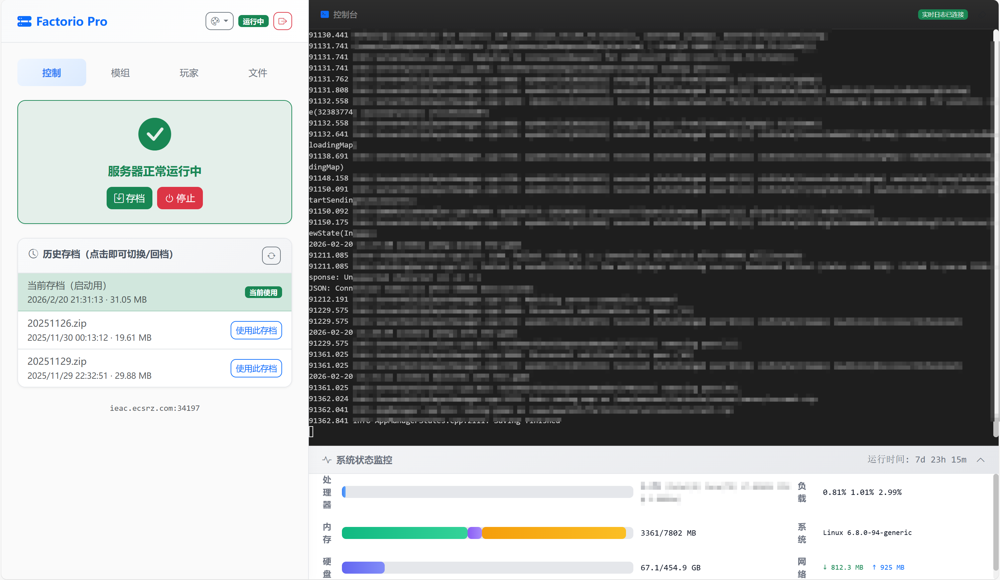

# FactorioWeb

FactorioWeb 是一个功能强大的 Factorio 游戏服务器 Web 管理面板，提供了直观、便捷的服务器管理工具，支持实时监控、Mod 管理、玩家管理等多种功能。

## 项目功能

### 🎮 服务器控制
- **启动/停止服务器**：通过 Web 界面一键启动或停止 Factorio 服务器
- **版本管理**：支持选择不同的 Factorio 服务端版本，自动检查更新并显示当前版本对比
- **地图管理**：切换地图存档，查看和管理历史存档，支持回档操作
- **游戏保存**：一键保存游戏进度，自动创建带时间戳的备份存档
- **实时进度条**：文件复制和存档切换操作显示实时进度，提供更好的用户体验

### 📦 Mod 管理
- **Mod 门户**：直接从 Factorio Mod 门户下载和安装 Mod
- **本地上传**：支持从本地上传 Mod 文件（.zip 格式）
- **已安装列表**：查看和管理已安装的 Mod

### 👥 玩家管理
- **玩家操作**：踢出 (Kick)、封禁 (Ban)、解封 (Unban) 玩家
- **权限管理**：设置管理员，添加/移除白名单
- **物品投放**：给指定玩家投放物品，支持从物品库中选择物品
- **投票踢人**：支持玩家发起投票踢人功能

### 📄 配置管理
- **配置编辑器**：详细的服务器配置编辑界面，支持设置服务器名称、描述、最大玩家数等
- **配置文件管理**：上传、管理配置文件
- **自动前缀**：自动为服务器名称和描述添加前缀

### 📊 系统监控
- **实时监控**：监控服务器 CPU、内存、硬盘、网络使用情况
- **系统信息**：查看系统运行时间、负载等信息
- **实时日志**：通过 WebSocket 实时查看服务器日志

### 🤖 自动响应系统
- **周期性消息**：按设定间隔自动发送公告（15分钟/30分钟/每小时/每2小时/每6小时/每12小时/每天）
- **定时任务**：在指定时间点发送一次性消息
- **关键词回复**：监听游戏内聊天，自动回复预设内容
- **玩家事件响应**：玩家上线欢迎、下线告别消息
- **多种运行模式**：支持 Cron 定时任务和守护进程模式

### 🔐 安全管理
- **敏感信息管理器**：安全管理 Factorio.com 凭据
- **密码保护**：密码和令牌不回显，只允许写入
- **输入过滤**：严格过滤输入，防止注入攻击

### 🎨 界面功能
- **多皮肤支持**：默认风格、工业风格、Factorio 风格
- **响应式设计**：适配不同屏幕尺寸
- **实时通知**：操作结果实时通知
- **多页面设计**：新增仪表盘、控制台、日志、密码工具等专用页面
- **现代化 UI**：全新的用户界面设计，提供更好的用户体验
- **皮肤系统**：可自定义界面风格，满足不同用户的审美需求

### 🔧 技术特性
- **WebSocket 支持**：通过 WebSocket 实现实时通信
- **安全认证**：登录系统，保护管理面板安全
- **命令执行**：支持执行 Factorio 服务器命令
- **物品库**：内置 Factorio 2.0 + Space Age 物品库，支持中文/英文搜索
- **RCON 连接池**：优化的 RCON 连接管理，提高服务器响应速度
- **模块化架构**：采用服务层架构，代码结构清晰，易于维护
- **自动响应系统**：支持周期性消息、定时任务、关键词回复和玩家事件响应
- **守护进程管理**：实时监控和管理守护进程状态
- **多页面前端**：全新的多页面前端设计，包括仪表盘、控制台、日志等页面
- **皮肤系统**：支持多种界面风格，包括默认、工业和 Factorio 风格

## 技术栈

- **后端**：PHP + Workerman (WebSocket 服务器)
- **前端**：HTML + JavaScript + Bootstrap 5 + Axios + XTerm.js
- **配置文件**：JSON 格式

## 目录结构

```
FactorioWeb/
├── data/                  # 配置文件示例目录
├── logs/                  # 日志目录
├── mods/                  # Mod 目录
├── saves/                 # 本地存档目录
├── server/                # 服务器配置目录
│   ├── saves/             # 服务器存档
│   ├── server-banlist.json
│   ├── server-adminlist.json
│   └── server-whitelist.json
├── setting/               # 实际使用的配置文件目录
├── versions/              # Factorio 服务端版本目录
├── web/                   # Web 界面目录
│   ├── app/               # 应用核心
│   │   ├── controllers/   # 控制器
│   │   │   ├── AuthController.php
│   │   │   ├── ServerController.php
│   │   │   ├── ChatController.php
│   │   │   ├── DaemonController.php
│   │   │   ├── FileController.php
│   │   │   ├── LogController.php
│   │   │   └── SystemController.php
│   │   ├── services/      # 服务层
│   │   │   ├── AuthService.php
│   │   │   ├── FileService.php
│   │   │   ├── MonitorService.php
│   │   │   ├── RconService.php
│   │   │   ├── ChatService.php
│   │   │   ├── ServerService.php
│   │   │   ├── StateService.php
│   │   │   ├── VoteService.php
│   │   │   ├── ItemService.php
│   │   │   └── PlayerService.php
│   │   ├── core/          # 核心类
│   │   │   ├── App.php
│   │   │   ├── Response.php
│   │   │   ├── ConfigLoader.php
│   │   │   └── LogConfig.php
│   │   ├── helpers/       # 辅助函数
│   │   │   └── functions.php
│   │   ├── modules/       # 功能模块
│   │   │   └── autoResponder/  # 自动响应模块
│   │   ├── public/        # 前端文件
│   │   │   ├── pages/     # 页面文件
│   │   │   ├── assets/    # 静态资源
│   │   │   └── favicon.ico
│   │   ├── scripts/       # 脚本文件
│   │   ├── api.php        # API 接口
│   │   ├── auth.php       # 认证系统
│   │   ├── autoResponder.php  # 自动响应系统
│   │   ├── autoResponderDaemon.php  # 自动响应守护进程
│   │   ├── configEditor.php  # 配置编辑器
│   │   ├── factorioRcon.php  # RCON 客户端
│   │   ├── logWs.php      # WebSocket 日志服务
│   │   ├── maps.php       # 地图管理
│   │   ├── rconPoolClient.php  # RCON 连接池客户端
│   │   ├── rconPoolDaemon.php  # RCON 连接池守护进程
│   │   ├── secureConfig.php  # 安全配置
│   │   ├── sendChat.php   # 发送聊天消息
│   │   ├── tz.php         # 时区设置
│   │   ├── update_items.php  # 更新物品库
│   │   └── websocket_server.php  # WebSocket 服务器
│   ├── config/            # 配置文件
│   │   ├── game/          # 游戏相关配置
│   │   └── system/        # 系统配置
│   ├── lib/               # 第三方库
│   │   ├── workerman/     # Workerman WebSocket 库
│   │   └── vendor/        # 其他依赖
│   ├── run/               # 运行时文件
│   ├── index.php          # 入口文件
│   └── .htaccess          # Apache 配置
├── 项目开发/              # 项目开发文档
│   ├── 项目框架.md        # 项目框架说明
│   └── 函数说明.md        # 函数详细说明
├── README.md              # 项目说明
└── image.png              # 项目图片
```

## 安装方法

### 1. 克隆仓库

```bash
git clone https://github.com/airxw/FactorioWeb.git
cd FactorioWeb
```

### 2. 安装依赖

项目使用 PHP 和 Workerman，需要确保服务器上安装了 PHP 7.4 或更高版本。

```bash
# 安装 Workerman 依赖
cd web/lib/workerman
composer install
```

### 3. 配置服务器

1. **复制配置文件示例**：

```bash
# 复制服务器设置文件
cp setting/server-settings.example.json setting/server-settings.json

# 复制地图生成设置文件
cp setting/map-gen-settings.example.json setting/map-gen-settings.json

# 复制地图设置文件
cp setting/map-settings.example.json setting/map-settings.json

# 复制认证配置文件（包含敏感信息，请勿推送到 Git）
cp web/config/system/auth.php.example web/config/system/auth.php
```

2. **编辑配置文件**：根据你的服务器环境进行调整。

   **注意**：`web/config/system/auth.php` 包含敏感信息（密码哈希、Factorio Token 等），该文件已被添加到 `.gitignore`，不会推送到 GitHub。请确保在本地编辑该文件时填入真实的配置信息。

### 4. 配置 Web 服务器

#### 使用宝塔面板（推荐）

1. 在宝塔面板中创建一个网站
2. 网站根目录设置为 `FactorioWeb/web`
3. 配置 PHP 版本为 7.4 或更高
4. 启动网站

#### 手动配置 Nginx

```nginx
server {
    listen 80;
    server_name factorio-web.example.com;
    root /path/to/FactorioWeb/web;
    index index.html index.php;

    location / {
        try_files $uri $uri/ /index.html;
    }

    location ~ \.php$ {
        fastcgi_pass unix:/run/php/php7.4-fpm.sock;
        fastcgi_index index.php;
        fastcgi_param SCRIPT_FILENAME $document_root$fastcgi_script_name;
        include fastcgi_params;
    }
}
```

### 5. 启动服务

```bash
# 启动 WebSocket 服务器
cd web
php app/logWs.php start

# 启动自动响应守护进程
php app/autoResponderDaemon.php start

# 启动 RCON 连接池守护进程
php app/rconPoolDaemon.php start
```

## 使用说明

### 1. 访问 Web 界面

在浏览器中访问你的服务器地址，例如 `http://factorio-web.example.com`。

### 2. 登录系统

首次访问时，你需要登录系统。默认登录凭据：
- 用户名：admin
- 密码：password

### 3. 服务器控制（控制标签页）

#### 启动服务器
1. 在「控制」标签页中，选择要使用的服务端版本
2. 选择要加载的地图存档
3. 点击「启动服务器」按钮

#### 检查和更新版本
1. 在版本选择旁边，点击「检查更新」按钮
2. 系统会显示当前版本、最新稳定版和最新实验版
3. 如果当前版本不是最新版本，会显示提示信息
4. 可以点击「安装」按钮来安装新版本

#### 停止服务器
1. 当服务器运行时，点击「停止」按钮

#### 保存游戏
1. 当服务器运行时，点击「存档」按钮
2. 系统会自动保存当前游戏状态
3. 同时会创建一个带时间戳的备份存档（如 `myworld_backup_20260221_153045.zip`）
4. 存档列表会自动刷新，显示所有最新的存档

#### 切换地图
1. 在「历史存档」列表中，查看所有存档（包括手动存档、自动存档和备份存档）
2. 当前使用的存档会标记为绿色并显示在列表顶部
3. 点击要使用的存档旁边的「使用此存档」按钮
4. 确认切换操作
5. 系统会显示复制进度条，显示操作完成情况
6. 复制完成后，下次启动服务器将使用新选择的存档

### 4. Mod 管理（模组标签页）

#### 从 Mod 门户安装
1. 点击「打开 Mod 门户」按钮
2. 输入 Factorio.com 的用户名和 Token
3. 搜索要安装的 Mod
4. 点击 Mod 旁边的安装按钮

#### 本地上传 Mod
1. 点击「本地上传」按钮
2. 选择要上传的 Mod 文件（.zip 格式）
3. 点击「上传」按钮

### 5. 玩家管理（玩家标签页）

#### 玩家操作
1. 在「目标玩家」输入框中输入玩家名称
2. 点击对应的操作按钮：
   - 🔴 封禁 (Ban)
   - 🟠 踢出 (Kick)
   - 🟢 设为管理
   - 🔵 解封
   - 🟣 + 加白名单
   - ⚫ - 移出白名单

#### 给玩家发送物品
1. 在「目标玩家」输入框中输入玩家名称
2. 点击「打开物品库」按钮
3. 在物品库中选择要发送的物品
4. 输入要发送的数量
5. 点击「发送」按钮

#### 投票踢人
1. 在「投票踢人」区域，输入目标玩家名称
2. 点击「发起投票」按钮
3. 其他玩家可以通过聊天命令参与投票

### 6. 文件管理（文件标签页）

#### 上传文件
1. 在「快速上传」区域，选择要上传的文件（支持 .zip 和 .json 格式）
2. 点击上传按钮

#### 管理文件
- **地图存档**：查看和管理服务器的地图存档
- **配置文件**：查看和管理服务器的配置文件

### 7. 配置编辑器

1. 在浏览器中访问 `http://factorio-web.example.com/config-editor.php`
2. 填写配置文件名
3. 配置服务器基本信息、玩家设置、可见性设置、认证信息、网络设置等
4. 点击「保存为新配置副本」按钮

### 8. 系统监控

在主界面下方的「系统状态监控」区域，可以查看服务器的实时状态：
- CPU 使用情况
- 内存使用情况
- 硬盘使用情况
- 网络流量
- 系统运行时间和负载
- 在线玩家数量

### 9. 界面导航

#### 仪表盘页面
- 显示服务器状态概览
- 提供快速操作按钮
- 展示系统资源使用情况
- 显示最近的服务器活动

#### 控制台页面
- 实时服务器日志查看
- 命令执行界面
- 玩家在线状态监控
- 服务器性能实时数据

#### 日志页面
- 详细的服务器日志记录
- 日志筛选和搜索功能
- 日志导出选项
- 错误和警告高亮显示

#### 密码工具页面
- 密码生成器
- 密码强度检查
- 敏感信息管理

#### 皮肤切换

点击顶部的皮肤切换按钮，可以选择不同的界面风格：
- 默认风格
- 工业风格
- Factorio 风格

## 安全注意事项

1. **修改默认登录凭据**：确保修改默认的登录凭据，使用强密码
2. **限制访问**：考虑使用防火墙或 IP 白名单限制对 Web 界面的访问
3. **定期更新**：定期更新项目代码和依赖，以修复安全漏洞
4. **使用 HTTPS**：在生产环境中使用 HTTPS 加密传输
5. **保护 Factorio.com 凭据**：不要在公共场合泄露 Factorio.com 的用户名和 Token

## 故障排除

### WebSocket 连接失败

1. 确保 Workerman WebSocket 服务器正在运行：
   ```bash
   cd web
   php app/logWs.php status
   ```
2. 检查防火墙设置，确保 WebSocket 端口（默认为 8080）已开放
3. 检查前端配置中的 WebSocket 连接地址是否正确

### 服务器启动失败

1. 检查服务端版本是否正确下载
2. 检查地图存档是否有效
3. 检查配置文件是否正确
4. 查看服务器日志以获取详细错误信息

### Mod 安装失败

1. 检查 Factorio.com 的用户名和 Token 是否正确
2. 检查网络连接是否正常
3. 检查服务器磁盘空间是否充足

### 物品投放失败

1. 确保玩家名称输入正确
2. 确保物品代码输入正确
3. 检查服务器是否正在运行

## 技术细节

### 服务层架构

项目采用了模块化的服务层架构，主要包括：

- **StateService**：统一管理所有运行时状态数据
- **VoteService**：投票踢人管理服务
- **ItemService**：物品管理服务
- **PlayerService**：玩家历史管理服务
- **MonitorService**：系统监控服务
- **RconService**：RCON 连接管理服务
- **ChatService**：聊天设置管理服务
- **ServerService**：服务器管理服务

### WebSocket 通信

项目使用 Workerman 实现 WebSocket 通信，用于实时日志传输和命令执行。

### 物品库

项目内置了 Factorio 2.0 + Space Age 的物品库，支持中文/英文搜索。

### 多皮肤支持

项目支持三种不同的界面风格：
- 默认风格：简洁现代的界面
- 现代风格：工业风格的界面
- Factorio 风格：模仿 Factorio 游戏界面的风格

### 项目效果
https://github.com/airxw/FactorioWeb/blob/main/image.png

## 贡献

欢迎提交 Issue 和 Pull Request 来改进这个项目。

### 开发环境设置

1. 克隆仓库：
   ```bash
   git clone https://github.com/airxw/FactorioWeb.git
   cd FactorioWeb
   ```

2. 安装依赖：
   ```bash
   cd web/lib/workerman
   composer install
   ```

3. 启动开发服务器：
   ```bash
   cd web
   php -S localhost:8000
   ```

## 许可证

本项目使用 MIT 许可证。

## 联系方式

- **GitHub**：[https://github.com/airxw/FactorioWeb](https://github.com/airxw/FactorioWeb)
- **QQ群**：1137842268

## 更新日志

### v1.0.0
- 初始版本
- 支持服务器控制、Mod 管理、玩家管理等基本功能
- 支持实时监控和 WebSocket 通信
- 支持多皮肤切换

### v1.1.0
- 新增物品库功能，支持 Factorio 2.0 + Space Age
- 优化 Mod 管理界面
- 改进系统监控功能
- 修复已知 bug

### v1.2.0
- **改进存档管理系统**：
  - 修复了多分地图备份显示问题
  - 实现了真实存档名称追踪，不再只显示 current.zip
  - 添加了当前使用存档的标记和排序
- **改进存档切换功能**：
  - 增加了详细的错误检查和权限验证
  - 添加了文件大小显示和复制验证
  - 改进了用户反馈提示
- **实时进度条功能**：
  - 为文件操作添加了实时进度条组件
  - 显示复制进度百分比和详细信息
  - 防止用户在操作未完成前进行其他操作
- **改进游戏保存功能**：
  - 添加了智能保存和自动备份功能
  - 每次保存自动创建带时间戳的备份存档
  - 保存后自动刷新存档列表
  - 提供清晰的用户反馈
- **版本检查改进**：
  - 添加了当前版本检测功能
  - 显示当前版本与最新版本的对比
  - 提供是否需要更新的提示
- **代码质量改进**：
  - 修复了 PHP 语法警告
  - 改进了数组访问的规范性
  - 优化了错误处理机制

### v1.3.0
- **自动响应系统**：
  - 新增周期性消息功能，支持按设定间隔自动发送公告
  - 新增定时任务功能，在指定时间点发送一次性消息
  - 新增关键词自动回复，监听聊天内容并自动回复
  - 新增玩家事件响应，支持上线欢迎和下线告别消息
  - 支持 Cron 定时任务和守护进程两种运行模式
- **敏感信息管理器**：
  - 新增安全的凭据管理界面
  - 支持管理 Factorio.com 用户名、密码和 Token
  - 密码和令牌不回显，只允许写入
  - 严格过滤输入，防止注入攻击
- **守护进程管理**：
  - 新增实时监控守护进程功能
  - 支持通过 Web 界面启动/停止守护进程
  - 提供进程状态监控和日志查看
- **玩家管理增强**：
  - 新增已知玩家列表（从日志分析）
  - 支持玩家名/IP 搜索和快速选择
  - 改进玩家操作的用户体验
- **系统稳定性改进**：
  - 优化了 WebSocket 连接稳定性
  - 改进了错误处理和日志记录
  - 修复了多个已知问题

### v2.0.0 (最新)
- **架构重构**：
  - 采用服务层架构，模块化设计
  - 新增 StateService：统一状态数据管理
  - 新增 VoteService：投票踢人管理
  - 新增 ItemService：物品管理服务
  - 新增 PlayerService：玩家历史管理
  - 新增 MonitorService：系统监控服务
  - 新增 RconService：RCON 连接管理
  - 新增 ChatService：聊天设置管理
  - 新增 FileService：文件操作管理
  - 新增 AuthService：用户认证管理
  - 优化核心类结构
- **功能增强**：
  - 新增投票踢人功能
  - 改进 RCON 连接管理，添加连接池
  - 优化物品管理系统
  - 增强玩家历史记录功能
  - 改进系统监控服务
  - 新增多页面前端设计，包括仪表盘、控制台、日志等页面
  - 增强自动响应系统，支持多种消息类型和触发方式
  - 新增守护进程管理功能
  - 改进皮肤系统，支持更多界面风格
- **性能优化**：
  - 优化 WebSocket 通信
  - 改进日志管理和轮转
  - 优化配置加载机制
  - 提高系统响应速度
  - 优化 RCON 连接池管理
- **代码质量**：
  - 统一命名规范
  - 改进错误处理
  - 优化代码结构
  - 增加代码注释
  - 模块化设计，提高代码可维护性
- **文件结构优化**：
  - 重新组织 web/app 目录结构
  - 分离控制器、服务、核心类等组件
  - 新增模块目录，支持功能扩展
  - 优化前端文件组织
  - 新增脚本目录，便于维护和管理

## 截图



---

感谢使用 FactorioWeb！如果您有任何问题或建议，欢迎在 GitHub 上提交 Issue 或加入 QQ 群讨论。

